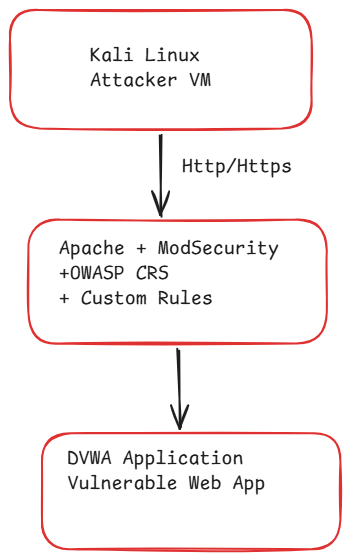

# Architecture

## Overview

This project demonstrates the deployment of a Web Application Firewall (WAF) using ModSecurity and the OWASP Core Rule Set (CRS) in front of DVWA (Damn Vulnerable Web Application).

The objective of this lab is to understand how modern WAFs detect, score, correlate and block common web attacks such as:

- SQL Injection (SQLi)
- Cross Site Scripting (XSS)
- Local File Inclusion (LFI)
- Protocol Violations
- Unauthorized Client Access

---

## Architecture Diagram



---

## Components

### 1. Kali Linux (Attacker Machine)

Used to simulate malicious requests against the target application.

Examples:

1. SQL Injection payloads
2. XSS payloads
3. Local File Inclusion payloads
4. Requests originating from blocked IP addresses

---

### 2. Apache Web Server

Apache acts as the front-end web server responsible for serving the application.

Incoming requests are received on:

1. HTTP (Port 80)
2. HTTPS (Port 443)

Before requests reach DVWA they are inspected by ModSecurity.

---

### 3. ModSecurity Web Application Firewall

ModSecurity acts as an application layer firewall integrated into Apache.

Responsibilities:

1. Intercept incoming requests
2. Inspect headers, parameters and request bodies
3. Apply security rules
4. Generate alerts and logs
5. Block malicious traffic

---

### 4. OWASP Core Rule Set (CRS)

OWASP CRS provides pre-built attack detection rules.

Examples from this project:

| Attack Type | Rule IDs |
|------------|----------|
| SQL Injection | 942100 |
| XSS | 941100, 941110, 941160 |
| LFI | 930100, 930110, 930120 |
| Blocking Decision | 949110 |
| Correlation Engine | 980130 |
| Protocol Enforcement | 920350 |

---

### 5. Custom Rules

In addition to OWASP CRS rules, custom ModSecurity rules were implemented.

Example:

a. Blocking requests from a specific IP address.
b. Logging custom events.
c. Testing custom response behaviour.

Example custom rule:

```apache
SecRule REMOTE_ADDR "@ipMatch 10.80.239.204" \
"id:13423432,\
phase:1,\
deny,\
log,\
status:403,\
msg:'Blocked Kali machine'"
```

---

### 6. DVWA (Damn Vulnerable Web Application)

DVWA acts as the protected application.

Without the WAF:

```text
Attack Request -> DVWA -> Database
```

With the WAF:

```text
Attack Request -> ModSecurity -> OWASP CRS -> Blocked
```

---

### 7. MariaDB Database

The backend database stores user information used by DVWA.

Examples:

a, User credentials
b. User profiles
c. Application data

The WAF prevents malicious requests from reaching the database layer.

---

## Request Processing Pipeline

```text
Incoming HTTP/HTTPS Request
            |
            v
Apache Web Server
            |
            v
ModSecurity WAF
            |
            v
OWASP CRS Rule Evaluation
            |
            +--------------------+
            |                    |
            | Attack Detected    |
            |                    |
            v                    v
        HTTP 403             Request Allowed
         Returned                  |
                                   v
                               DVWA Application
                                   |
                                   v
                              MariaDB Database
```

---

## Detection Workflow

### Step 1: Request Interception

Apache receives an incoming request and passes it to ModSecurity.

### Step 2: Rule Matching

ModSecurity evaluates the request against OWASP CRS signatures.

Examples:

a. SQLi signatures
b. XSS signatures
c. LFI signatures

### Step 3: Anomaly Scoring

Each triggered rule contributes to an anomaly score.

Example:

```text
SQLI = 10
XSS  = 15
LFI  = 35
```

### Step 4: Blocking Evaluation

The blocking engine compares the anomaly score against the configured threshold.

If exceeded:

```text
HTTP 403 Forbidden
```

is returned.

### Step 5: Logging

Security events are written to Apache and ModSecurity logs for analysis.

---

## Implemented Security Controls

This project implemented the following controls:

a. SQL Injection protection
b. Cross Site Scripting protection
c. Local File Inclusion protection
d. Protocol enforcement
e. HTTPS support
f. Custom IP blocking
g. Rule tuning and exclusions

---

## Conclusion

This architecture demonstrates how ModSecurity and OWASP CRS can be deployed in front of a vulnerable application to provide 
application-layer protection against common web attacks while allowing legitimate traffic to reach the backend application.
